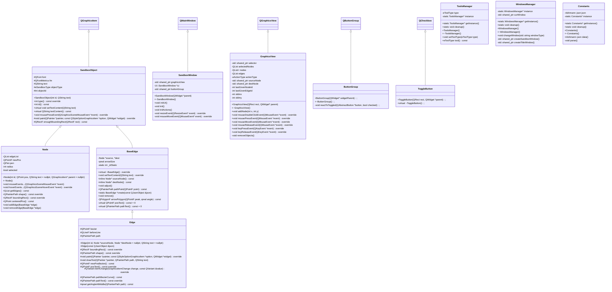

```mermaid
classDiagram
  QGraphicsItem <|-- SandboxObject
  SandboxObject <|-- Node
  SandboxObject <|-- BaseEdge
  BaseEdge <|-- Edge
  class SandboxObject{
    #QFont font
    #QFontMetrics fm
    #QString text
    #eSandboxType objectType
    #int objectId
    +SandboxObject(int id, QString text)
    +int type() const override
    +int id() const
    +virtual void setTextContent(QString text)
    +virtual QString textContent() const
    +void mousePressEvent(QGraphicsSceneMouseEvent *event) override
    #void paint(QPainter *painter, const QStyleOptionGraphicsItem *option, QWidget *widget) override
    #QRectF enoughBoundingRect(QRectF rect) const
  }

  class Node{
    -QList<BaseEdge*> edgeList
    -QPointF newPos
    -QPen pen
    -int radius
    -bool selected
    +Node(int id, QPoint pos, QString text = nullptr, QGraphicsItem* parent = nullptr)
    +~Node()

    +void mouseEvents...(QGraphicsSceneMouseEvent *event)
    +void hoverEvents...(QGraphicsSceneHoverEvent *event) override

    +QList<BaseEdge*> getEdges() const
    +QPainterPath shape() const override
    +QRectF boundingRect() const override
    +QPoint centeredPos() const
    +void addEdge(BaseEdge *edge)
    +void removeEdge(BaseEdge *edge)
  }
  class BaseEdge{
    -Node *source, *dest
    -qreal arrowSize
    -static int _idStatic
    +virtual ~BaseEdge() override
    +void setTextContent(QString text) override
    +inline Node* sourceNode() const
    +inline Node* destNode() const
    +void adjust()
    +QPainterPath pathPoint(QPointF point) const
    +static BaseEdge *create(const QJsonObject &json)
    +void remove()
    -QPolygonF arrowPolygon(QPointF peak, qreal angle) const
    -virtual QPointF posText() const = 0
    -virtual QPainterPath pathText() const = 0
  }
  class Edge{
    #QPointF bezier
    #QLineF beforeLine
    #QPainterPath path
    +Edge(int id, Node *sourceNode, Node *destNode = nullptr, QString text = nullptr)
    +Edge(const QJsonObject &json)
    #QRectF boundingRect() const override
    #QPainterPath shape() const override
    #void paint(QPainter *painter, const QStyleOptionGraphicsItem *option, QWidget *widget) override
    #void drawText(QPainter *painter, QPainterPath path, QString text)
    #QPointF newPosBezier() const
    #QPointF posText() const override
    #QVariant itemChange(GraphicsItemChange change, const QVariant &value) override
    #QPainterPath pathBezierCurve() const
    #QPainterPath pathText() const override
    #qreal getAngleAtMiddle(QPainterPath path) const
  }
  QMainWindow <|-- SandboxWindow
  class SandboxWindow{
    -std::shared_ptr<GraphicsView> graphicsView
    -Ui::SandboxWindow *ui
    -std::shared_ptr<ButtonGroup> buttonGroup
    +SandboxWindow(QWidget *parent)
    +~SandboxWindow()
    +void initUI()
    -void init()
    -void initActions()
    -void resizeEvent(QResizeEvent* event) override
    -void mouseMoveEvent(QMouseEvent* event) override
  }
  QGraphicsView <|-- GraphicsView
  class GraphicsView{
    +GraphicsView(QRect rect, QWidget* parent)
    +~GraphicsView()
    +void addNode(int x, int y)
    +void mouseDoubleClickEvent(QMouseEvent *event) override
    +void mousePressEvent(QMouseEvent *event) override
    +void mouseMoveEvent(QMouseEvent *event) override
    +void mouseReleaseEvent(QMouseEvent *event) override
    +void keyPressEvent(QKeyEvent *event) override
    +void keyReleaseEvent(QKeyEvent *event) override
    -void removeObjects()
    -std::shared_ptr<Selector> selector
    -QList<QGraphicsItem*> selectedNodes
    -QList<std::shared_ptr<Node>> nodes
    -QList<Edge*> edges
    -eActionType actionType
    -std::shared_ptr<Node> sourceNode
    -std::shared_ptr<Node> destNode
    -int lastGivenNodeId
    -int lastGivenEdgeId
    -int oldmx
    -int oldmy
  }
  QButtonGroup <|-- ButtonGroup
  class ButtonGroup{
    +ButtonGroup(QWidget* widgetParent);
    +~ButtonGroup();
    -void reactToToggled(QAbstractButton *button, bool checked);    
  }
  QCheckbox <|-- ToggleButton
  class ToggleButton{
    +ToggleButton(QRect rect, QWidget *parent);
    +virtual ~ToggleButton();
  }
  class ToolsManager{
    +static ToolsManager* getInstance()
    +static void cleanup()
    +ToolsManager()
    +~ToolsManager()
    +void setToolType(eToolType type)
    +eToolType tool() const
    -eToolType type
    -static ToolsManager* instance    
  }
  class WindowsManager{
    +static WindowsManager* getInstance()
    +static void cleanup()
    +WindowsManager()
    +~WindowsManager()
    +void changeWindow(std::string windowType)
    -std::shared_ptr<SandboxWindow> createSandboxWindow()
    -std::shared_ptr<TitleWindow> createTitleWindow()
    -static WindowsManager* instance
    -std::shared_ptr<QMainWindow> curWindow    
  }
  class Constants{
    +static Constants* getInstance()
    +static void cleanup()
    +Constants()
    +~Constants()
    +nlohmann::json data()
    -void parse()
    -nlohmann::json json
    -static Constants* instance
  }            
```